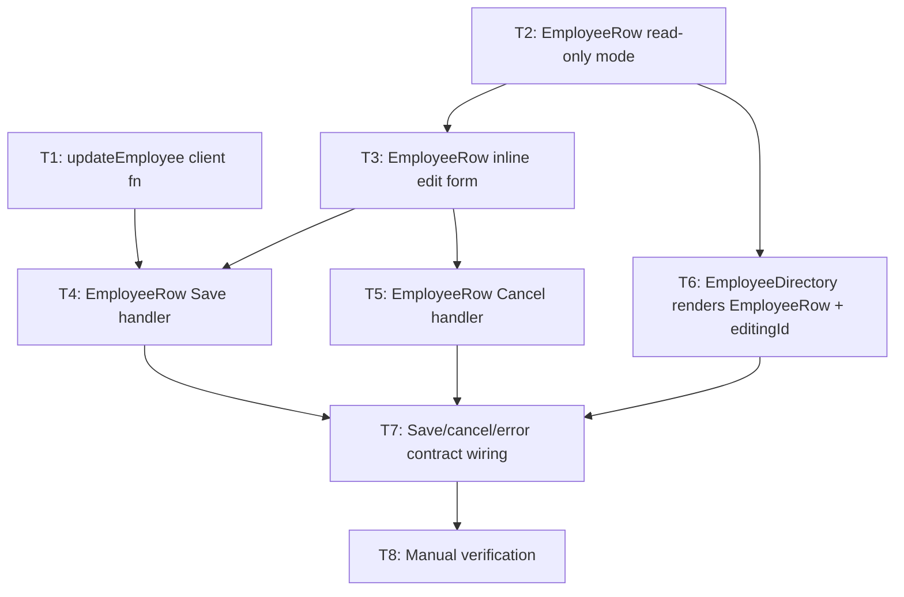

# Implementation Plan: EPMCDMETST-60121 — Edit employee details from the Employee Directory

Derived from `architecture.md`. Tasks are ordered by dependency, not just by FR number. All work is UI-only (`ui/src/`); no backend files change.

## Task List

| ID | Task | Files | Satisfies | Depends on | Priority |
|---|---|---|---|---|---|
| T1 | Add `updateEmployee(id, data)` to the API client — `fetchJson(\`/employees/${id}\`, { method: 'PUT', body: JSON.stringify(data) })` | `ui/src/api/employees.js` | FR-7 | — | P0 |
| T2 | Extract `EmployeeRow` component, read-only mode only: move the existing `<li>` markup (name, department, Delete button) out of `EmployeeDirectory`'s `.map()` and add the "Edit" button (`onEdit(id)` callback) | `ui/src/components/EmployeeRow.jsx` (new) | FR-1 | — | P0 |
| T3 | Add inline edit-mode rendering to `EmployeeRow`: local `name`/`department` state pre-filled from props, `required` on the name input, toggled by an `isEditing` prop | `ui/src/components/EmployeeRow.jsx` | FR-2, FR-6 | T2 | P1 |
| T4 | Wire `EmployeeRow`'s Save handler: call `updateEmployee(id, { name, department })`, disable the Save button while the request is in flight and re-enable on settle, call `onSaved()` on success | `ui/src/components/EmployeeRow.jsx` | FR-4 (client side) | T1, T3 | P1 |
| T5 | Wire `EmployeeRow`'s Cancel handler: reset local form state to the original props, call `onCancel()`, no network call | `ui/src/components/EmployeeRow.jsx` | FR-5 | T3 | P1 |
| T6 | Refactor `EmployeeDirectory`: add `editingId` state, render one `EmployeeRow` per employee (passing `isEditing`, `onEdit`, `onSaved`, `onCancel`, `onDelete`) instead of the raw `<li>` | `ui/src/views/EmployeeDirectory.jsx` | FR-3 | T2 | P1 |
| T7 | Finish the save/cancel/error contract in `EmployeeDirectory`: `onSaved` triggers `refresh()` and clears `editingId`; a 404 from Save surfaces via the existing `setError` and also clears `editingId` (stale-row case); `onCancel` just clears `editingId` | `ui/src/views/EmployeeDirectory.jsx` | FR-4 (integration), stale-edit 404 handling | T4, T5, T6 | P2 |
| T8 | Manual verification against FR-1–FR-7 (no automated test suite exists in this repo — see below) | — | All FRs | T7 | P3 |

## Dependency Graph

## Execution Order (topological)

1. **T1** and **T2** — no dependencies, can be done in parallel (different files).
2. **T3** — needs T2 (extends the same component).
3. **T4**, **T5**, **T6** — can proceed in parallel once their prerequisites land: T4 needs T1+T3, T5 needs T3, T6 needs T2 only.
4. **T7** — needs T4, T5, and T6 all merged; this is where the row-level callbacks and the directory's `editingId`/`error` state actually get connected.
5. **T8** — last; nothing else is unverified once T7 is done.

## Blocked Tasks

- **T3 is blocked until T2 lands** — it edits the same component T2 creates; starting it earlier means working against a file that doesn't exist yet.
- **T4 is blocked until both T1 and T3 land** — it calls `updateEmployee` (T1) from inside the edit form (T3). Missing either one leaves it with nothing to call or nowhere to call it from.
- **T5 is blocked until T3 lands** — Cancel only makes sense once there's edit-mode form state to discard.
- **T7 is blocked until T4, T5, and T6 all land** — it's the integration point; wiring the parent's `editingId`/`refresh`/`error` logic to callbacks that don't exist yet would just mean redoing it.
- **T8 is blocked until T7 lands** — verifying FR-3/FR-4/FR-5 end-to-end requires the full save/cancel/error path to be wired, not just the isolated pieces.
- **T1 and T2 are NOT blocked** — they're the two starting points and can be worked in either order or in parallel.

## Notes carried over from architecture.md

- No backend changes in scope; `PUT /api/employees/:id` and `employeeStore.update()` are already correct for this use case (per architecture's Technology Choices).
- No optimistic-concurrency guard and no server-side name validation — both explicitly accepted as out of scope in `architecture.md` and `requirements.md`. Don't add them as unplanned tasks.
- This repo has no test framework configured (`api/` and `ui/` `package.json` have no test scripts) — T8 is a manual pass through FR-1–FR-7, not an automated suite. Adding a test framework is a separate, pre-existing gap and out of scope for this story.
