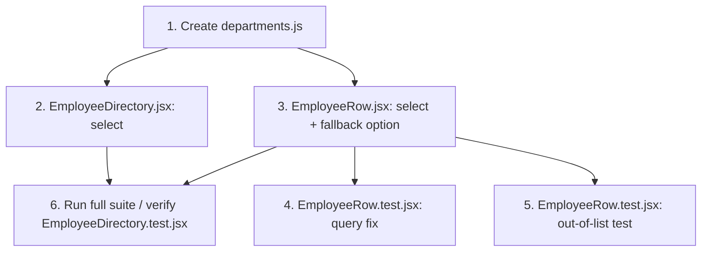

# Implementation Plan: EPMCDMETST-60862 — Constrain department field to a fixed list in Employee Directory (add/edit)

## Task List
| # | Task | Files | Depends On |
|---|---|---|---|
| 1 | Create the shared fixed department list. | `ui/src/constants/departments.js` (new) | — |
| 2 | Replace the add-employee form's free-text department `<input>` with a `<select aria-label="Department">`: blank `-- No department --` placeholder option first, then one `<option>` per `DEPARTMENTS` entry; `department` state keeps initializing to `''`. | `ui/src/views/EmployeeDirectory.jsx` | 1 |
| 3 | Replace the inline edit form's free-text department `<input>` with a `<select aria-label="Department">`: same blank placeholder + `DEPARTMENTS` options, plus one extra fallback `<option>` (e.g. `Current: <value>`) rendered only when `employee.department` is truthy and not present in `DEPARTMENTS`, so an out-of-list stored value still displays as selected. | `ui/src/components/EmployeeRow.jsx` | 1 |
| 4 | Update the test that fills in the department field on inline edit: replace `screen.getByPlaceholderText('Department')` with `screen.getByRole('combobox', { name: 'Department' })`, and replace `userEvent.clear` + `userEvent.type` with `userEvent.selectOptions(departmentSelect, 'Platform')`. | `ui/src/components/EmployeeRow.test.jsx` | 3 |
| 5 | Add a test: an employee whose `department` is not in `DEPARTMENTS` (e.g. `'Contracting'`) still renders in the row and opens the inline edit form without throwing, and the select shows that value selected via the fallback option (covers FR-5). | `ui/src/components/EmployeeRow.test.jsx` | 3 |
| 6 | Run the full UI test suite and confirm `EmployeeDirectory.test.jsx` still passes unmodified — its existing `getByDisplayValue('Engineering')` / `getByDisplayValue('Grace Hopper')`-style assertions match a `<select>`'s selected-option display text the same way they matched an `<input>`'s value, so no edit is expected there, but this must be verified rather than assumed. | `ui/src/views/EmployeeDirectory.test.jsx` (verify only, no edit anticipated) | 2, 3 |

## Dependency Graph

## Execution Order
1. Task 1 (no dependencies — must exist before either component imports it).
2. Tasks 2 and 3 (independent of each other, both depend only on Task 1).
3. Tasks 4 and 5 (independent of each other, both depend on Task 3).
4. Task 6 last, after all component and test edits are in place.

## Blocked Tasks
None. All tasks are unblocked once Task 1 completes; no external dependency, credential, or missing-prerequisite issue.

## Notes Carried Over
- No task touches `ui/src/api/employees.js`, `api/routes/employees.js`, or `employeeStore.js` — confirmed unchanged in `architecture.md` and `design-review.md`.
- The blank placeholder option (Task 2, Task 3) is required to preserve today's optional department behavior — this was the one design-review finding that changed `architecture.md` itself; it is not an implementer's discretionary choice.
- `aria-label="Department"` on both selects is required so Task 4/5 can query by accessible name (`getByRole('combobox', { name: 'Department' })`), per `design-review.md` Finding #3.
- `EmployeeDirectory.test.jsx` has no dedicated "add employee" test coverage today (only edit-flow tests) — this is a pre-existing gap, not one introduced by this change, and adding add-flow test coverage is not in this task list; only verifying the existing edit-flow assertions still hold (Task 6) is in scope.
- No task creates an admin UI for the list, migrates existing free-text data, or adds server-side validation — all explicitly out of scope per `requirement.md`.

## Source
- `architecture.md` (this repo, root, as revised by `design-review.md`)
- `design-review.md` (this repo, root)
- `requirement.md` (this repo, root)
- `ui/src/views/EmployeeDirectory.jsx`, `ui/src/components/EmployeeRow.jsx`, `ui/src/components/EmployeeRow.test.jsx`, `ui/src/views/EmployeeDirectory.test.jsx` (current implementations, this repo)
- Jira: EPMCDMETST-60862 — "Constrain department field to a fixed list in Employee Directory (add/edit)"
